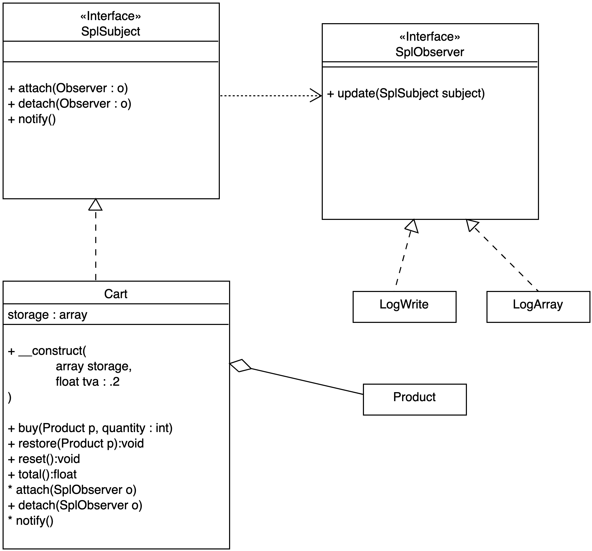

# Design Patterns Observer

## Intérêt 

Ce pattern est très utile pour déclencher une/des action(s) en fonction d'une autre. Par exemple, si un utilisateur commande un produit on notifie cette commande dans une table spécifique pour faire des statistiques sur les achats. On peut également notifier d'autre information en fonction de l'achat, et cela sans modifier le code de la classe observée.

L'Observer est donc une solution modulable, évolutif et testable pour ce type de problème par exemple.

### 01 Exemple

- L'interface **SplSubject** de PHP, cette interface définie une classe donnée comme observable (Subject), elle devra donc implémenter (interface) des méthodes spécifiques (attach, detach et notify) : 

```php

class User implements SplSubject{

    private $id;
   
    public function attach(SplObserver $observer) {
        $this->observers[] = $observer;
    }

    public function detach(SplObserver $observer){}

    public function notify() {

        foreach ($this->observers as $value) {
            $value->update($this);
        }
    }

    public function create(string $name, string $email):void {

        $this->id = uniqid(true);
        $this->notify();
    }

    public function getId(){
        return $this->id;
    }
}
```

Voyons maintenant une classe observeur (Observer) avec l'interface SplObserver (méthode update) de PHP :

```php

class Log implements SplObserver{

    public function update( SplSubject $subject) {
        echo "log :" . $subject->getId() . "<br>";
    }
}
```

Maintenant, si vous créez un utilisateur la méthode create de User le notifie à son/ses observeur(s) :

```php
$subject = new User;
$subject->attach(new Log);

// crée un nouvel utilisateur => notification 
$subject->create('Alan', 'alan@alan.fr');
```

### 01 Exercice Cart Observer

*Vous devez implémenter ce design pattern et faire une campagne de tests unitaires documentée et structurée. Vous devez être en mesure lors de la correction d'expliciter votre démarche en vous appuyant de votre documentation.*

Présentez les tests dans un fichier à part pour expliciter vos tests.

Pour cet exercice respectez l'organisation du composant Cart suivante :


Soient les classes Cart, Product et les observeurs LogFile et LogSum. La classe Cart sera la classe Subject (Observable).

Remarque : pour la classe Cart utilisez un tableau PHP comme storage, nous utiliserons ici une version plus simple de cette classe que nous avons déjà vue. Voyez dans la partie annexe pour le code de la classe Cart et son Storage.

### tests Observable

**L'objectif des tests pour voir si vous avez bien implémenter l'Observable sera : à chaque fois que vous ajoutez un produit dans le panier, de notifiez le total des prix à ses observeurs, mais également lorsque vous retirez un produit de notifier le total pour ses observers.**

L'observeur LogFile enregistrera le nom du produit commandé dans un fichier log.txt. L'observeur LogSum notifiera l'ajout du produit dans une variable.

- Utilisez la fonction **file_put_contents** de PHP pour écrire une ligne dans un fichier.

```php
file_put_contents(__DIR__ . DIRECTORY_SEPARATOR . 'log.txt', $product->getName());
```

Pensez pour se dernier observeur à caster la valeur du total enregistrer dans le fichier de log. Utilisez la fonction file_get_contents poru récupérer son contenu.

La classe Cart implémentera (contrat de l'interface SplSubject ) les méthodes suivantes :

- attach pour ajouter un observeur de la classe Cart.

```php
// $o est un Observer son type est SplObserver
$cart->attach($o);
```

- detach pour supprimer un observeur de la classe Cart.

```php
$cart->detach($o);
```

- notify() notifie à l'observeur d'une action

Aidez-vous du diagramme de classes et de l'exemple de code ci-dessous, vous ajouterez des produits et vérifierez que les notifications ont été effectué. Créez une méthode getStorage, par exemple, dans l'observeur LogSum pour contrôler les notifications. 



Remarques : LogArray est à remplacer par LogSum.

```php

use App\Cart\{Cart, LogFile, LogSum};

$cart = new Cart([]);

// Observers
$logFile = new LogFile;
$logSum = new LogSum;

// Ajoutez des produits ...

// detach Observer
$cart->detach($logSum);
$cart->detach($logFile);


// recommandez des produits et vérifiez qu'ils ne sont pas de LogSum
```

### Annexes

```php

class Cart 
{
    private $storage;
    private $tva;

    public function __construct(array $storage = [], float $tva = 0.2)
    {
        $this->tva = $tva;
        $this->storage = $storage;
    }

    public function buy(Product $product, int $quantity): void
    {
        $total = $quantity * $product->getPrice() * ($this->tva + 1);

        $this->storage[$product->getName()] = $total;
    }

    public function reset(): void
    {
        $this->storage = [];
    }

    public function total(): float
    {
        return array_sum($this->storage);
    }

    public function restore(Product $product): void
    {
        if (isset($this->storage[$product->getName()])) {
            unset($this->storage[$product->getName()]);
        }
    }

}
```

- Product

```php
<?php

namespace Cart;

class Product{

    /**
     * name
     *
     * @var string
     */
    private $name;

    /**
     * price
     *
     * @var float
     */
    private $price;

    public function __construct($name, $price)
    {
        $this->setName($name);
        $this->setPrice($price);
        
    }

    /**
     * Get name
     *
     * @return  string
     */ 
    public function getName()
    {
        return $this->name;
    }

    /**
     * Set name
     *
     * @param  string  $name  name
     *
     * @return  self
     */ 
    public function setName(string $name)
    {
        $this->name = $name;

        return $this;
    }

    /**
     * Get price
     *
     * @return  float
     */ 
    public function getPrice()
    {
        return $this->price;
    }

    /**
     * Set price
     *
     * @param  float  $price  price
     *
     * @return  self
     */ 
    public function setPrice(float $price)
    {
        $this->price = $price;

        return $this;
    }
}
```
