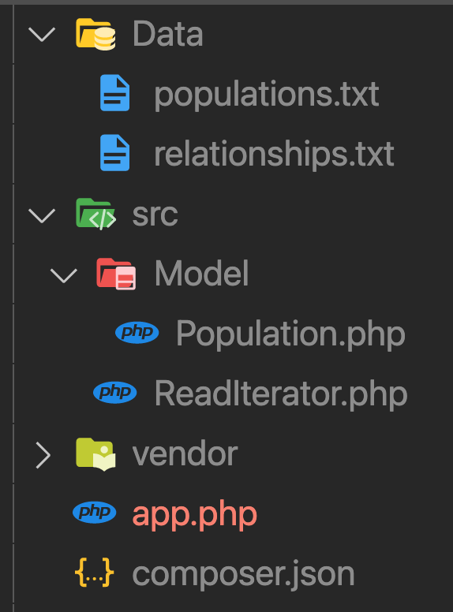

# Itérateur

Les itérateurs permettent de parcourir simplement un ensemble de données. Un **foreach** permet d'itérer sur un ensemble par exemple.

Supposons que l'on souhaite lire le contenu d'un fichier comportant un grand nombre de lignes. On utilisera par exemple la fonction PHP **fopen** qui permet de lire ligne par ligne le fichier. Elle est permet de faire un script qui n'utilisera pas beaucoup de mémoire :

```php
$f = fopen('data/temperatures.txt', 'r');
while (!feof($f)) {
    // lecture ligne par ligne
    $line = fgets($f);
}
fclose($f);
```

à la place de ce code vous pouvez utiliser l'itérateur PHP SplFileObject :

```php
$temperatures = new SplFileObject('data/temperatures.txt');

foreach( $temperatures as $line ){
    // ...
}
```

En utilisant la méthode oef pour repérer la fin du fichier on peut itérer sur fichier pour lire son contenu ligne par ligne sans consommer beaucoup de mémoire.

```php
while (!$file->eof()) {
    $line  =  $file->fgets();
}
```

## Générateur d'utilisateur

Supposons que nous souhaitions configurer et traiter un ensemble de 10000 objets de type **User**, une première solution, peu optimale, serait de créer un tableau dans lequel on les placerait :

```php
class User{
    private string $name = 'anonymous';

    public function __construct(string $name){
        $this->name = $name;
    }

    public function getName():string{
        return $this->name;
    }
}

$count = 1;
$users = [];
while($count < 10000){
    $users[] = new User("Alan_$count") ;
    $count++;
}

$users = [new User('Alan_1'), new User('Alan_2'), ...];
```

Mais on peut également créer un **générateur** qui va les créer dynamiquement, sans occuper de la mémoire pour les stocker, notez la présence du mot clé yield, nous l'expliciterons ci-après :

```php
function generatorUser(){
    $count = 0;
    while($count < 100){
        $count++;

        yield  new User("name_$count");
    }
}
```

Une fois que l'on a créer le générateur il faudra alors itérer sur ce dernier à l'aide d'un foreach par exemple pour les récupérer :

```php
$generator = generatorUser();

foreach( $generator as $user) 
    echo $user->getName();
```

Dans ce cas nous avons fait l'économie de la place mémoire du premier tableau users.

Fonctionnement du générateur : 

- Il faut tout d'abord itérer sur le générateur pour exécuter le code, avec un foreach par exemple

- Le mot clé yield retourne une valeur sans sortir de la fonction. 

- Condition d'arrêt. On crée un **compteur** count dans l'exemple précédent, à chaque appel du générateur dans le foreach celui-ci garde la mémoire de la valeur de cette variable. Cela permet donc de définir une condition d'arrêt dans les itérations.


## 01 Exercice population itérateurs/générateurs

Soient deux fichiers txt populations.json et relationships.json. En vous aidant des itérateurs et/ou générateurs.

Utilisez pour construire la classe ReadFile les fonctions fopen et fgets ainsi que fclose.

Respectez la structure de fichiers et dossiers suivantes :



1. Créez un objet qui permet d'hydrater les données que vous allez traiter.

2. Modifiez la liste populations ou la structure de l'objet, pour ajouter une clé relation de type array.

3. Ajoutez les relations (liste relationships) de chaque user de cette population. Puis placez les relations de chaque user dans la liste populations en utilisant relationships.

4. Calculer la moyenne des relations.


Remarques : utilisez les bonnes structures pour traiter les données.


